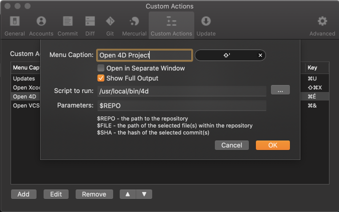

# scripts

Utility scripts for 4D

## 4d

Open with 4D folder, project or source file using the command line

### Usage

#### Open 4d

```
4d 
```
same as `open -a "4D"`

#### Open a projet root folder

```
4d $HOME/Kaluza # open the project inside $HOME/Kaluza/Project/
```

##### for current folder

```
4d
```
or
```
4d .
```

#### Open a projet file

```
4d $HOME/Kaluza/Project/Kaluza.4DProject 
```

#### Open a source file (if inside a project)

```
4d $HOME/Kaluza/Project/Sources/Methods/install_github.4dm
```

### Install on macOS

Download and add execution right

```bash
curl -L https://raw.githubusercontent.com/mesopelagique/scripts/master/macos/4d -o /usr/local/bin/4d && chmod +x /usr/local/bin/4d
```

#### Use sudo if you have no right access to /usr/local/bin/

```bash
sudo curl -L https://raw.githubusercontent.com/mesopelagique/scripts/master/macos/4d -o /usr/local/bin/4d && sudo chmod +x /usr/local/bin/4d
```

### Use with other tools

#### SourceTree (Git GUI)

[SourceTree](https://www.sourcetreeapp.com/) allow you to use custom action. 



So using a shortcut, you can open your 4d project in 4D.

💡You can achieve this with other tools. (You can Pull Request this project to explain how)
