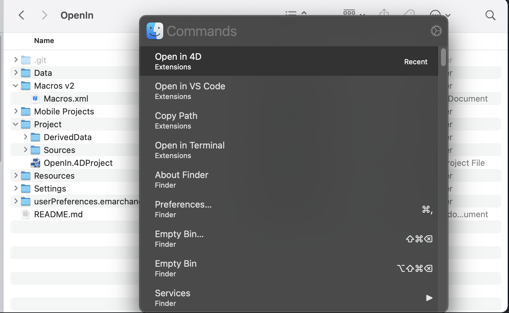
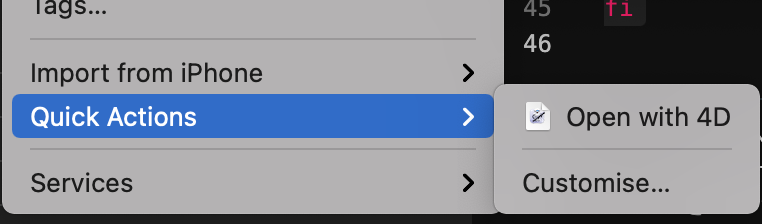

# OpenWith4D

Utility scripts to open with 4D for macOS from Terminal and other apps.

## Why?

The current version of 4D do not allow to open the project folder or a source file not in current opened project.

This script will find associated project file to open it.

## Install on macOS

Download using terminal

```bash
sudo curl -L https://raw.githubusercontent.com/mesopelagique/OpenWith4D/master/macos/4d -o /usr/local/bin/4d && chmod +x /usr/local/bin/4d
```

> 💡 Your password will be prompted to install in `/usr/local/bin`

or If you need only [quick action](#quick-action) section

## Usage

### Usage in Terminal

Open with 4D folder, project or source file using the command line.

#### Open 4d

```
4d 
```

same as `open -a "4D"`

#### Open a projet root folder

```
4d $HOME/Kaluza # open the project inside $HOME/Kaluza/Project/
```

##### for current folder

```
4d
```

or

```
4d .
```

#### Open a projet file

```
4d $HOME/Kaluza/Project/Kaluza.4DProject 
```

#### Open a source file (if inside a project)

```
4d $HOME/Kaluza/Project/Sources/Methods/install_github.4dm
```

### Use with SourceTree (Git GUI)

[SourceTree](https://www.sourcetreeapp.com/) allow you to use custom action. 


So using a shortcut, you can open your 4d project in 4D.

### Use with Paletro and Finder.app

[Paletro](https://appmakes.io/paletro) allow to [add extension](https://appmakes.io/paletro/docs/#/Build-Extension)

Download this project source file and open folder `openin4d.pext`, it will install the extension if you have [Paletro](https://appmakes.io/paletro) 

> App available also using [Setapp](https://go.setapp.com/invite/neko4) (the Netflix of Mac Apps).



### Use with ...

💡 You can achieve this with other tools. (You can Pull Request this project to explain how)


## Quick Action

MacOs allow you to create with automator some quick action that could be avaiable in Finder, and oher app



You can download a [zipped version in release](https://github.com/mesopelagique/OpenWith4D/releases/download/0.0.1/Open.with.4D.workflow.zip) or download this project sources

Open the workflow to install it.
